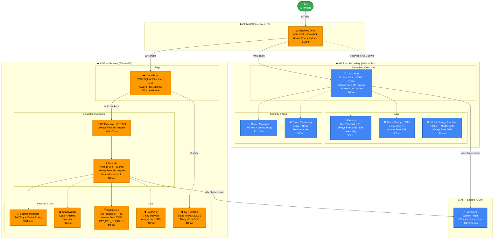

# Architecture — Sauda AI CV Generator
## Multi-Cloud Serverless (AWS Primary + GCP Secondary)

> **Design goal:** Always-Free-tier-first. Every service chosen has a free tier or falls within training credits ($200 AWS + $300 GCP) with < $3 total cost for 5 days.

---

## Architecture Diagram



---

## HA Features Built In

| الميزة | كيف تعمل | التكلفة |
|---|---|---|
| **Lambda Multi-AZ** | تلقائي — AWS تشغّل Lambda في أكثر من AZ | $0 |
| **Route 53 Failover** | Health check كل 10 ثوانٍ → تحويل تلقائي لـ GCP | $1/شهر |
| **CloudFront Failover Origin** | إذا API Gateway أعاد 5xx → CloudFront يحوّل لـ Cloud Run | $0 إضافي |
| **Cloud Run Traffic Split** | نشر canary وترجيع بدون downtime | $0 |
| **DynamoDB Multi-AZ** | تلقائي — DynamoDB مُوزّع داخلياً | $0 |
| **Firestore Multi-Region** | nam5 location = US multi-region | $0 |

---

## Data Flow — CV Generation

```
1. User → CloudFront/CloudRun → POST /answer
2. Lambda / Cloud Run:
   a. Verify JWT (check DynamoDB / Firestore blacklist)
   b. Process questionnaire step
   c. Final step → call Vertex AI (Gemini Flash) for CV text enhancement
   d. Generate PDF via PDFKit
   e. Upload PDF to S3 / Cloud Storage
   f. Return presigned download URL
3. User → GET /download-cv/:sessionId → presigned URL redirect
```

---

## Cost Breakdown (Dev — 5 Days)

| الخدمة | التكلفة/شهر | 5 أيام |
|---|---|---|
| Lambda + API Gateway | ~$0.10 | < $0.02 |
| DynamoDB | $0 | $0 |
| S3 + CloudFront | ~$0 | $0 |
| WAF (CloudFront) | $6 | $1 |
| Secrets Manager | $0.80 | $0.13 |
| Route 53 | $1 | $0.16 |
| Cloud Run | $0 | $0 |
| Firestore | $0 | $0 |
| Cloud Storage | $0 | $0 |
| Vertex AI | ~$3 | $0.50 |
| **المجموع** | **~$11** | **~$1.81** |

---

## Removed Services vs. Previous Architecture

| ما أُزيل | التوفير/شهر | السبب |
|---|---|---|
| GCP VPC Connector | **$144** | Cloud Run لا تحتاجه بدون Memorystore |
| GCP Cloud Load Balancing | **$18** | Cloud Run لديه HTTPS مباشر مع TLS |
| GCP Memorystore Redis HA | **$15** | استُبدل بـ Firestore (Always Free) |
| AWS ECS Fargate | **$18** | استُبدل بـ Lambda (Always Free) |
| AWS ALB | **$17** | استُبدل بـ API Gateway ($0.10/mo) |
| AWS VPC Interface Endpoints (4x) | **$29** | Lambda تعمل خارج VPC |
| AWS ElastiCache Redis | **$19** | استُبدل بـ DynamoDB (Always Free) |
| AWS WAF (ALB Regional) | **$6** | WAF على CloudFront يكفي |
| **إجمالي التوفير** | **$266/شهر** | |
